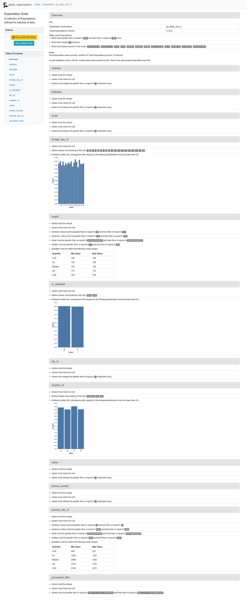

# What is Great Expectations?
Great Expectations helps teams save time and promote analytic integrity by offering a unique approach to automated testing: pipeline tests. Pipeline tests are applied to data (instead of code) and at batch time (instead of compile or deploy time). Pipeline tests are like unit tests for datasets: they help you guard against upstream data changes and monitor data quality.

Software developers have long known that automated testing is essential for managing complex codebases. Great Expectations brings the same discipline, confidence, and acceleration to data science and engineering teams.

# Features
## Expectations

Expectations are the workhorse abstraction in Great Expectations. Like assertions in traditional python unit tests, Expectations provide a flexible, declarative language for describing expected behavior. Unlike traditional unit tests, Great Expectations applies Expectations to data instead of code.

Great Expectations currently supports native execution of Expectations in three environments: pandas, SQL (including distributed environments like BigQuery and Redshift), and Spark. This approach follows the philosophy of “take the compute to the data.” Future releases of Great Expectations will extend this functionality to other frameworks, such as dask.

## Automated data profiling

Writing pipeline tests from scratch can be tedious and overwhelming. Great Expectations jump starts the process by providing powerful tools for automated data profiling. This provides the double benefit of helping you explore data faster, and capturing knowledge for future documentation and testing.

## Data Contexts and Data Sources

…allow you to configure connections to your Datasources, using names you’re already familiar with: “the ml_training_results bucket in S3,” “the Users table in Redshift.” Great Expectations provides convenience libraries to introspect most common data stores (Ex: SQL databases, data directories and S3 buckets.) We are also working to integrate with pipeline execution frameworks (Ex: Airflow, dbt, Dagster, Prefect). The Great Expectations framework lets you fetch, validate, profile, and document your data in a way that’s meaningful within your existing infrastructure and work environment.

## Tooling for validation

Evaluating Expectations against data is just one step in a typical validation workflow. Checkpoints make the followup steps simple, too: storing validation results to a shared bucket, summarizing results and posting notifications to slack, handling differences between warnings and errors, etc.

Great Expectations also provides robust concepts of Batches and Runs. Although we sometimes talk informally about validating “dataframes” or “tables,” it’s much more common to validate batches of new data—subsets of tables, rather than whole tables. Data Contexts provide simple, universal syntax to generate, fetch, and validate Batches of data from any of your DataSources.

## Data Docs

Great Expectations can render Expectations to clean, human-readable documentation. Since docs are compiled from tests and you are running tests against new data as it arrives, your documentation is guaranteed to never go stale.

# Opinion
## Pros
- Decent UI
- Easy to start with
- Cool name
- Can add custom expectation rules (though documentation are not that clear)

## Cons
- Not suited for raw data validation
- Does not scale well with big sized tables
- Bad or lack of documentation
- Jupyter notebook centered, still not sure if everything can be done programmatically

# Example of validation result

